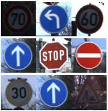

# AI System for Traffic Sign Recognition

A Deep Neural Network to do traffic sign recognition
 

  

## Highlights of project

- The traffic sign dataset that we will be working on is GTSRB — German Traffic Signs.
- The approach used is deep learning.
- The type of neural network used is a Convolutional Neural Network (CNN).
- Python is the language used to program this.
